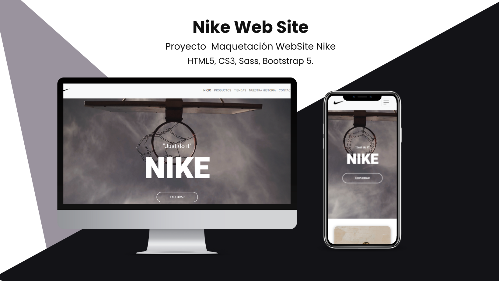

# WebSite Nike 

## Introduccion

¿De qué trata?
Es un proyecto trabajado con el fin de dar a conocer mis conocimientos adquiridos con el curso desarrollo web de CoderHouse con **HTML5, CSS3, SASS, BOOTSTRAP 5**.

Este proyecto esta pensado como una pagina de Nike, el cual podra ser consultado por los usuarios para conocer sus nuevos productos y servicios ofrecidos por NIke para Argentina. 

## Stack Tecnologico 

### Lenguales
1. HTML5
2. CSS3
3. SASS 
4. JAVASCRIPT 

### Framework
1. BOOTSTRAP 5.1.3

### Librerias
1. Data Aos => Para las Animaciones 