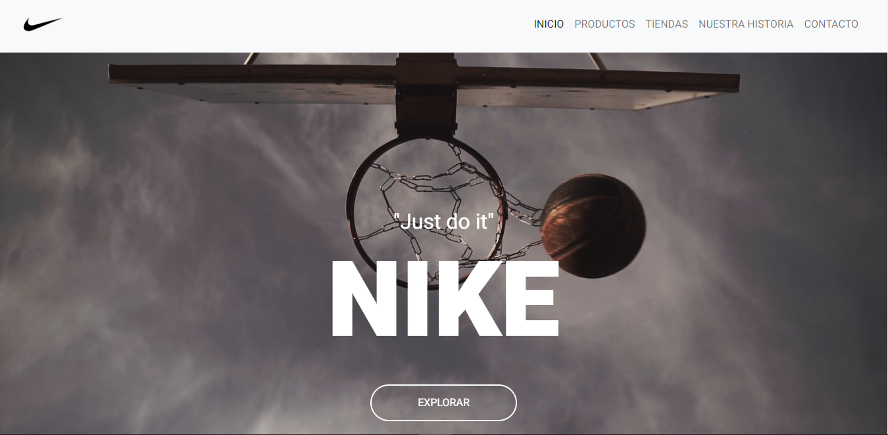
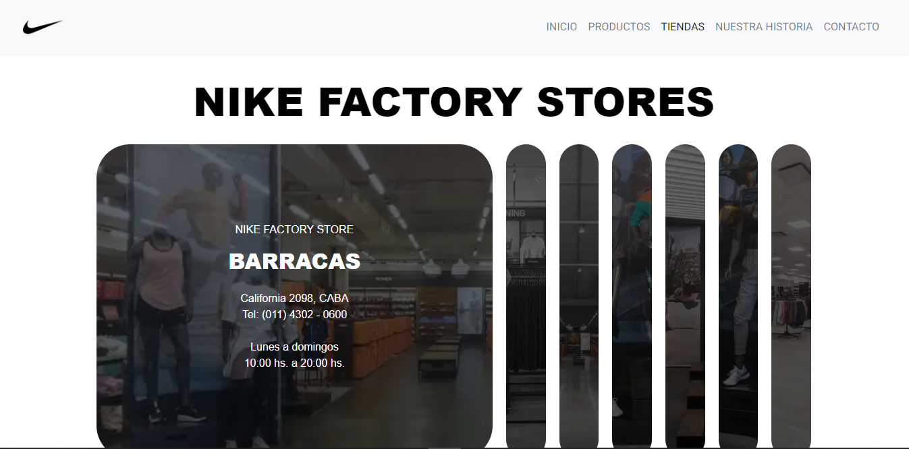
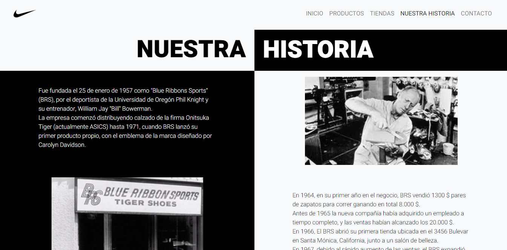
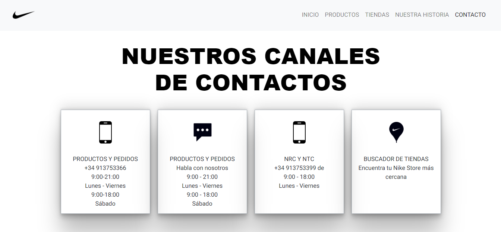

# Proyecto Web Site Nike AR

Este proyecto fue creado y pensado para el curso desarrollo web de CoderHouse. 
Este es un proyecto final el cual me base en la pagina oficial de Nike Argentina para copiar y modificar las partes que me hubieran gustado que tenga la pagina oficial.

Este proyecto me llevo 3 meses y todavia sigue teniendo correcciones.

Este fue mi primer proyecto web y es el inicio de mi camino como desarrollador Front-End Dev.

## Autor

- [@augustogutierrez288](https://github.com/augustogutierrez288)

## Feedback

Si tiene algún comentario, comuníquese conmigo en augustogutierrez8448@outlook.es

## 🛠 Skill 

HTML5, CSS3, SASS, PREPROS, BOOTSTRAP5, JAVASCRIPT

## Screenshots

### Page Inicio

### Page Productos

### Page Tiendas

### Page Sobre Nosotros

### Page Contactos 

